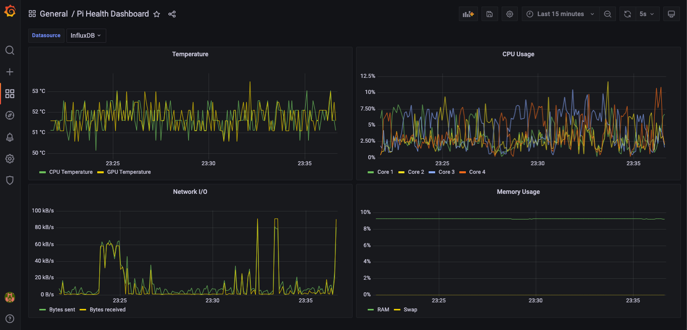

# pi-stat

pi-stat is a tool to collect Raspberry Pi health metric (temperature, CPU and RAM utilization) at fixed interval and send them to InfluxDB instance, which then can be visualized through a Grafana dashboard

### Stats monitored
- Temperature
    - CPU Temperature
    - GPU Temperature
- CPU
    - Usage per core
- RAM
    - RAM usage
    - Swap memory usage
- Network
    - Bytes sent per second
    - Bytes received per second

---

## How to use it
### Prerequisites
- Docker engine, CLI and docker-compose (if you want to run InfuxDB and Grafana via docker)
- Python3 and Pip3
- Raspberry Pi (of course!)

### Compatibility
The project was built and tested using below 
- Raspberry Pi 4B board with 8GB RAM
- Raspbian GNU/Linux 10 (buster) 32 bit OS

### Instructions
- clone the repo into pi folder system
- run InfluxDB and Grafana (using any of the below approach)
    - locally installed on Pi OS
    - via Docker containers (run `docker-compose -f docker-compose.yaml -d` if you have docker-compose installed)
- [if installed without docker-compose] open influx shell and create a new bucket by running below `create database pistat`
- copy `.env.sample` file to `.env` and set the values as applicable
- run `pip3 install -r requirements.txt` to install the required python packages
- run `python3 pi-stat/getstat.py`
- if configurations are correct, pi-stat utility should start pushing metrics to Influx DB. Keep the console running
- Open Grafana instance and login
- add a new InfluxDB data source and point it to running InfluxDB instance
- create a new dashboard by importing `dashboard.json` and select the InfluxDB datasource on the dashboard variable
